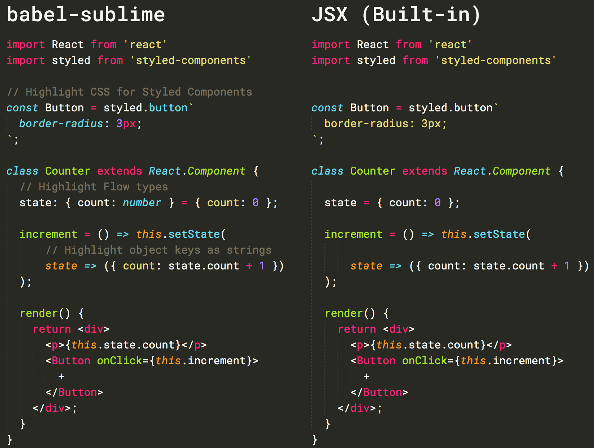

# babel-sublime

Language definition for [modern JavaScript](http://kangax.github.io/compat-table/es2016plus/) with [JSX syntax](http://facebook.github.io/react/docs/jsx-in-depth.html), [Flow typing](https://flow.org/), and [Styled Components](https://styled-components.com/).

## Installation

Find it as [**Babel**](https://packagecontrol.io/packages/Babel) through [Package Control](https://packagecontrol.io/).

#### Setting as the default syntax

To set it as the default syntax for a particular extension:

1. Open a file with that extension,
2. From the `View` menu, select `Syntax` → `Open all with current extension as…` → `Babel` → `JavaScript (Babel)`
3. Repeat this for each extension (e.g.: `.js` and `.jsx`).

#### Setting a Color Scheme

`Babel` comes bundled with `Next` from [Benvie/JavaScriptNext.tmLanguage](https://github.com/Benvie/JavaScriptNext.tmLanguage). From the command palette, select `UI: Select Color Scheme` and select `Next`.

## Screenshots

## Snippets

Find them separately at [babel/babel-sublime-snippets](https://github.com/babel/babel-sublime-snippets) or as [**Babel Snippets**](https://packagecontrol.io/packages/Babel%20Snippets) through [Package Control](https://packagecontrol.io/).

## About

Under the hood, `babel-sublime`'s syntax definition is built using [JS Custom](https://github.com/Thom1729/Sublime-JS-Custom). JS Custom is based on Sublime's [core JavaScript syntax](https://github.com/sublimehq/Packages), which is in turn descended from [Benvie/JavaScriptNext.tmLanguage](https://github.com/Benvie/JavaScriptNext.tmLanguage). Special thanks go to [@jgebhardt](https://github.com/jgebhardt) and [@zpao](https://github.com/zpao).

## Contributing

The `JavaScript (Babel).sublime-syntax` file itself is generated by JS Custom and should not be manually modified — any bug fixes or enhancements to the syntax itself should go through [JS Custom](https://github.com/Thom1729/Sublime-JS-Custom).

If you modify the commenting rules or Next theme, make sure to do so by editing the appropriate `YAML-tmPreferences` or `YAML-tmTheme` file and converting that file using [PackageDev](https://github.com/SublimeText/PackageDev). Then, commit both the source (YAML) file and the converted (XML) file.
